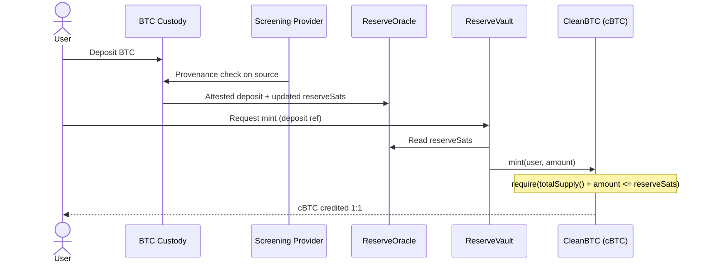
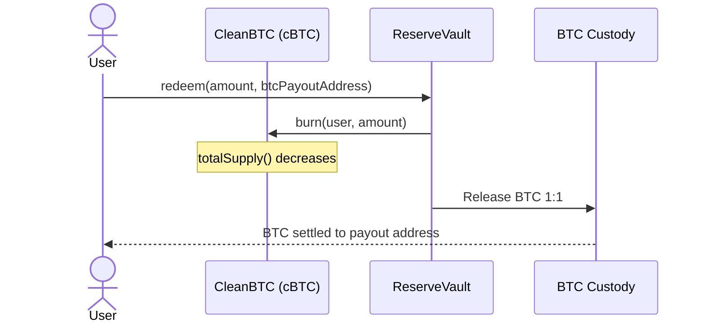

# Hakky Protocol Whitepaper

**The proof-of-clean layer for Bitcoin — 1 cBTC = 1 verifiably clean BTC.**

*Version 1.0 — Informational draft*

Tagline: **Keep crypto clean.**

- Website: [hakky.xyz](https://hakky.xyz) *(placeholder)*
- X: [@HakkyProtocol](https://x.com/HakkyProtocol) *(placeholder)*
- Source: [github.com/antihakkysack/hakky-protocol](https://github.com/antihakkysack/hakky-protocol)

> **Disclaimer.** This document is informational only. It is not an offer to sell, or a solicitation of an offer to buy, any security, token, or financial instrument, and nothing herein is investment, legal, tax, or accounting advice. Hakky Protocol is a compliance and provenance tool, not investment advice and not a means to evade lawful process. Forward-looking statements about roadmap features are aspirational and subject to change. See **Risks & Disclaimers** before relying on anything in this paper.

---

## 1. Abstract

Bitcoin is fungible in theory and increasingly non-fungible in practice. Every coin carries an immutable, publicly auditable history, and a growing compliance industry uses that history to decide which coins are acceptable and which are not. Coins that trace back to sanctioned entities, known exploits, or scam-tagged addresses are routinely frozen at exchange and OTC-desk deposit, while "clean" or "virgin" BTC trades at a premium. Yet the screening that produces these verdicts is opaque, performed off-chain, and non-portable: every venue re-screens from scratch, users learn their coins are tainted only when a withdrawal is blocked, and a clean bill of health cannot travel with the asset.

**Hakky Protocol** is a transaction-cleanliness layer for Bitcoin that turns cleanliness into a portable, composable, on-chain asset and attestation. It issues **cBTC ("Clean BTC")** — an ERC-20 token backed **1:1 by BTC held in verifiable reserve**, where the backing BTC has additionally **passed provenance screening**. The protocol combines a proof-of-reserves oracle, a mint-and-redeem vault, and a transparent registry of signed cleanliness attestations published by accredited screening firms. The solvency invariant `totalSupply() <= reserveSats` is enforceable at every mint and verifiable by anyone at any block.

Hakky screens *for* cleanliness; it never obscures, mixes, or anonymizes funds. It is the **opposite of a mixer**. This paper describes the problem, the architecture, the token mechanics, the attestation and reserve models, the protocol's compliance and privacy posture, and an honest account of its trust assumptions and decentralization roadmap.

---

## 2. The Problem

### 2.1 Tainted coins and frozen deposits

Bitcoin's transparency is a double-edged property. The same ledger that lets anyone verify supply also lets anyone trace flows. Blockchain-analytics firms maintain heuristics and address labels that connect UTXOs to sanctioned wallets (e.g. OFAC-listed addresses), exploit proceeds, ransomware, darknet markets, and scams. When BTC that touches those clusters arrives at a regulated venue, the deposit is frequently **frozen** pending review — sometimes permanently, sometimes pending off-chain documentation the depositor cannot produce.

The costs land on honest holders. A user who bought BTC on a reputable venue can still receive coins several hops removed from a tainted source and have no way to know before a withdrawal is blocked. Recovery is slow, adversarial, and jurisdiction-dependent.

### 2.2 The clean-BTC premium

Because tainted coins carry settlement risk, the market already prices cleanliness. **"Clean" or "virgin" BTC** — coins with short, unambiguous histories, sometimes freshly mined — trades at a premium on OTC desks. This premium is direct evidence that provenance is an economically meaningful, under-served attribute of a bitcoin, not a theoretical concern.

### 2.3 Screening is opaque, off-chain, and non-portable

Today's compliance screening has three structural defects:

| Defect | Consequence |
|---|---|
| **Opaque** | Verdicts are proprietary "risk scores" with little visibility into inputs; users cannot see why a coin was flagged or contest it. |
| **Off-chain** | Screening happens inside each venue's private systems; the result is a database row, not a verifiable artifact. |
| **Non-portable** | A clean result at one venue does not travel to the next; every counterparty re-screens from zero, duplicating cost and producing inconsistent verdicts. |

The **real alternative** a compliance-conscious holder faces today is therefore not "a better token" — it is *re-running opaque, off-chain screening at every venue and hoping the answers agree.* Hakky is positioned directly against that alternative: it makes a cleanliness result a first-class, portable, on-chain object that the holder controls and any counterparty can independently verify.

The stakes are concrete (frozen funds, blocked settlement), operational (duplicated compliance cost), and structural: a financial system where legitimacy cannot be proven forward is one where honest participants inherit other people's risk. Hakky exists to let honest users move Bitcoin value with a portable proof that the coins behind it are clean.

---

## 3. The Hakky Solution

Hakky wraps screened BTC into **cBTC**, a token whose two guarantees are inseparable:

1. **Backed** — each cBTC is redeemable 1:1 for BTC held in verifiable reserve, with supply that can never exceed proven reserves.
2. **Clean** — the BTC entering reserve has passed provenance screening, and cleanliness attestations for on-chain addresses are published to a transparent registry that anyone can read.

The name comes from community shorthand for tainted coins — a *"hakky sack"* (hacked / dirty coin passed hand to hand). Hakky Protocol is the **anti-hakky** layer: instead of quietly passing risk along, it lets honest users carry a portable, on-chain proof-of-clean.

### 3.1 Explicit contrast with mixers

This point is central and non-negotiable. **Hakky is the opposite of a mixer.**

| | Mixer / tumbler | Hakky Protocol |
|---|---|---|
| Goal | Break the link between source and destination | Preserve and *prove* a clean link |
| Effect on provenance | Destroys / obscures it | Screens it and publishes attestations |
| Transparency | Hides flows | Additive, public, transparent registry |
| Who it serves | Anyone seeking anonymity, including bad actors | Honest holders who want to demonstrate legitimacy |
| Regulatory direction | Away from screening | Toward auditable, user-consented screening |

Hakky **never** obscures, mixes, or anonymizes funds. It adds information (verifiable cleanliness), it does not remove it. A protocol that helped taint travel undetected would be the very thing Hakky exists to counter.

### 3.2 Who it is for

The best-fit users are participants for whom settlement certainty is worth more than a basis point: exchanges and OTC desks that want deposits they will not have to freeze, funds and treasuries with compliance mandates, payment and custody providers, and individual holders who simply want to prove their coins are clean before they move them.

---

## 4. Architecture

Hakky is a set of smart contracts plus an off-chain screening and custody pipeline that feeds them. Five contracts form the core.

| Module | Contract | Responsibility |
|---|---|---|
| Clean BTC token | `CleanBTC` (cBTC) | ERC-20; supply can never exceed proven reserves; transfers can be compliance-gated |
| Reserve oracle | `ReserveOracle` | Publishes attested BTC reserve balance (proof-of-reserves) as `reserveSats` |
| Mint / redeem vault | `ReserveVault` | Mints cBTC against verified BTC deposits; processes 1:1 redemptions |
| Attestation registry | `AttestationRegistry` | Accredited attestors publish signed cleanliness attestations per address |
| Compliance policy | `CompliancePolicy` | Configurable ruleset (`MONITOR \| GATED \| ALLOWLIST`) evaluated on transfers |

### 4.1 Roles

- `MINTER_ROLE` — held only by `ReserveVault`; the sole authority that can mint cBTC.
- `RESERVE_UPDATER_ROLE` — held by the reserve multisig; updates `reserveSats` and the reserve attestation pointer on `ReserveOracle`.
- `ATTESTOR_ROLE` — held by accredited screening providers; the only accounts that can publish or revoke attestations.
- Governance (later `$HAKKY`) — sets compliance mode and parameters, accredits attestors, controls the fee switch, and administers the reserve multisig.

### 4.2 Mint flow

A user sends BTC to a protocol-controlled custody address. Once the reserve oracle recognizes the verified deposit (and, where enabled, the deposit passes provenance screening), the vault mints an equal amount of cBTC — but only if minting keeps `totalSupply()` at or below `reserveSats`.



### 4.3 Redeem flow

Redemption is the mirror image. The holder burns cBTC; the vault instructs custody to release an equal amount of BTC to the holder's payout address. Burning lowers `totalSupply()`, so the solvency invariant is preserved by construction.



### 4.4 Screening and proof-of-reserves flow

Two independent off-chain pipelines feed the contracts. **Custodian attestations** flow to the reserve multisig, which writes `reserveSats` and a reserve report pointer to `ReserveOracle`. **Screening attestations** flow from accredited analytics firms, which write signed, per-address attestations to `AttestationRegistry`. The two are decoupled: reserves prove the money exists; attestations prove the addresses are clean.

---

## 5. cBTC Token Mechanics

`CleanBTC` is a standard ERC-20 with a small number of protocol-specific constraints.

| Property | Value |
|---|---|
| Name / symbol | Clean BTC / **cBTC** |
| Decimals | **8** (matches BTC natively) |
| Peg | 1 cBTC = 1 BTC, redeemable 1:1 |
| Supply authority | `ReserveVault` only (`MINTER_ROLE`) |
| Solvency invariant | `totalSupply() <= ReserveOracle.reserveSats()`, enforced at mint |
| Mint fee (v1) | 0 bps |
| Redemption fee (v1) | 0 bps |

### 5.1 The peg

The peg is maintained by full backing and free redemption, not by an algorithm or a market maker. Because 1 cBTC is always redeemable for 1 BTC from reserve, arbitrage keeps the secondary-market price near parity: if cBTC trades below 1 BTC, redemption is profitable; if above, minting is. The peg is only as strong as the reserve and the redemption right behind it — which is why proof-of-reserves (Section 7) and the honest trust model (Section 9) matter as much as the token contract.

### 5.2 The solvency invariant

Every mint checks that new supply will not exceed proven reserves. Expressed in the token's units (satoshis, given 8 decimals):

```
require(totalSupply() + amount <= ReserveOracle.reserveSats());
```

This makes over-issuance a contract-level impossibility rather than a policy promise. Anyone can independently verify solvency at any block by comparing `cBTC.totalSupply()` against `ReserveOracle.reserveSats()`.

### 5.3 The compliance hook

On transfer, cBTC can optionally consult `CompliancePolicy`. Critically, the **default deployment ships in `MONITOR` mode — no blocking.** In monitor-only mode cBTC behaves exactly like an ordinary ERC-20 and composes freely across DeFi; the policy contract merely observes. Gating is never on by default and can only be enabled by an explicit, public governance action (see Section 8). This design keeps the base asset maximally interoperable while leaving a compliance surface available to venues and jurisdictions that require one.

---

## 6. Cleanliness Attestation Model

Cleanliness is expressed as **attestations**: signed statements about a specific on-chain address, published to `AttestationRegistry` by accredited providers.

### 6.1 Attestors

Attestors are accredited screening providers — typically blockchain-analytics firms — granted `ATTESTOR_ROLE` by governance. Accreditation is a public, revocable act. Only role-holders can write or revoke attestations, so every attestation carries a known, accountable author.

### 6.2 Attestation structure

Each attestation for an address records:

| Field | Type | Meaning |
|---|---|---|
| `score` | uint (0–100) | Cleanliness score; higher is cleaner |
| `sanctioned` | bool | Whether the address is tied to a sanctioned entity |
| `provider` | address | The accredited attestor that signed it |
| `issuedAt` | timestamp | When it was issued |
| `expiresAt` | timestamp | When it lapses (default TTL **90 days**) |
| `evidenceURI` | string | IPFS/HTTPS pointer to the underlying screening report |

### 6.3 Expiry, revocation, and transparency

Attestations are **time-bounded**: provenance risk is not static, so an attestation carries a default 90-day TTL and is treated as stale once `expiresAt` passes. Attestors can also **revoke** an attestation before expiry if new information emerges. The registry is **additive and transparent** — nothing is ever hidden or silently overwritten; superseding statements are appended, and anyone can read the full history. The `evidenceURI` makes each verdict auditable rather than a black box, which is the direct remedy to the opacity described in Section 2.3.

Because the registry only ever *adds* verifiable information and never removes or obscures it, participating is a disclosure, not a concealment — reinforcing that Hakky is the antithesis of a mixer.

---

## 7. Proof of Reserves

Backing is only credible if it is provable. `ReserveOracle` is the contract that makes reserves legible on-chain.

- It stores **`reserveSats`** — total BTC in custody, denominated in satoshis.
- It stores a **`merkleRoot` / `attestationURI`** pointing to the published reserve report and signed custody attestations.
- It is updated by `RESERVE_UPDATER_ROLE`, a **multisig fed by custodian attestations**.

The load-bearing property is public verifiability of the solvency invariant:

```
cBTC.totalSupply() <= ReserveOracle.reserveSats()
```

Anyone — a user, an integrating venue, an auditor, a watchdog — can check this at any block without permission. Proof-of-reserves in v1 is an **attested** proof (it depends on honest custodian and multisig reporting), which the paper states plainly rather than overclaiming. The roadmap hardens it toward **threshold-signature** and **zero-knowledge proof-of-reserves**, reducing the trust placed in the reporting parties over time.

---

## 8. Compliance & Regulatory Posture

Hakky occupies a deliberate middle ground between two failure modes: the mixer (which frustrates lawful screening) and the surveillance-maximalist system (which strips users of privacy by default). Hakky is neither.

### 8.1 Sanctions and Travel Rule awareness

The `sanctioned` flag and the score threshold give integrating venues the primitives they need to respect sanctions regimes (e.g. OFAC) and to support Travel-Rule-style obligations, *if and where they are legally required to.* Attestations are portable, so a venue can honor a screening result the user already holds rather than forcing a redundant, opaque re-screen. Hakky provides the rails; regulated participants remain responsible for their own legal obligations.

### 8.2 Privacy-respecting by design

Compliance and privacy are not opposites here:

- **User-consented.** A holder chooses to obtain and carry an attestation. Hakky does not compel disclosure of anyone's identity or holdings.
- **Portable proofs, minimal disclosure.** An attestation demonstrates *cleanliness* about an address; it is not a KYC dossier. The roadmap's zero-knowledge direction aims to let a holder prove "I meet the policy" without revealing more than that.
- **No blocking by default.** `MONITOR` mode means the base asset does not censor transfers. Gating (`GATED`, `ALLOWLIST`) is opt-in per deployment and requires an explicit, on-chain governance decision.

### 8.3 What Hakky is not

Hakky is a compliance and provenance tool. It is **not** investment advice, **not** a mechanism to evade lawful process, and **not** a way to launder or anonymize funds. It does not help tainted coins pass as clean — it does the reverse, and its transparency makes any such attempt visible.

---

## 9. Trust Model & Decentralization Roadmap

Honesty about trust assumptions is a design principle, not a marketing afterthought.

### 9.1 v1 is not trustless — and we say so

In v1, BTC custody is **federated / qualified-custodian**, exactly like every 1:1 BTC-backed token in production today (for example, custodially wrapped BTC). This means users trust:

1. the **custodian(s)** to hold the backing BTC and honor redemptions,
2. the **reserve multisig** to report `reserveSats` honestly, and
3. the **accredited attestors** to screen competently and in good faith.

These are real trust assumptions. We state them plainly. The solvency invariant, transparent attestation registry, and public reserve reporting are designed to make dishonesty *detectable*, but v1 does not make it *impossible*.

### 9.2 Where it goes

The roadmap systematically reduces each trust assumption:

| Assumption today | Direction of travel |
|---|---|
| Federated custodian | Decentralized custody via MPC / threshold signatures |
| Attested (multisig) proof-of-reserves | Threshold-signature and zk proof-of-reserves |
| Governance-appointed attestors | Broader, decentralized attestation with on-chain accountability |

The destination is a protocol where cleanliness and backing are provable with minimal trusted parties — but v1 earns credibility by being honest about the distance still to travel.

---

## 10. Governance & $HAKKY

Protocol parameters — compliance mode, minimum score, attestor accreditation, the reserve-update multisig, and the fee switch — need an accountable controller. In v1 these are administered by the founding multisig under the constraints described above.

**`$HAKKY`** is the planned governance and utility token that will decentralize this control: governing policy parameters, attestor accreditation, the fee switch, and the reserve-update set. **`$HAKKY` is roadmap only. It is not launched in v1.** No token sale is promised or implied by this document or the associated repository. Any future launch would be announced through official channels and accompanied by its own terms; nothing here should be read as an offer.

---

## 11. Risks & Disclaimers

Participating in or integrating Hakky carries material risks. This list is not exhaustive.

- **Smart-contract risk.** The contracts may contain bugs or vulnerabilities despite review and auditing. Exploits could result in loss of funds. Use at your own risk.
- **Custody risk.** In v1, backing BTC is held by qualified custodians. Custodian failure, insolvency, seizure, or misconduct could impair redemption and break the peg.
- **De-peg risk.** cBTC may trade below 1 BTC on secondary markets, especially under stress, redemption friction, or loss of confidence in reserves. The peg depends on reserves and the redemption right, not on any guarantee.
- **Reserve / oracle risk.** `reserveSats` is an attested figure in v1. Dishonest or erroneous reporting, or multisig compromise, could misstate solvency.
- **Attestation risk.** Cleanliness scores are opinions produced by third-party analytics using imperfect heuristics. Attestations can be wrong, stale, revoked, or disputed; a clean attestation is not a legal guarantee that funds are lawful, and Hakky does not warrant any attestor's conclusions.
- **Regulatory risk.** The legal treatment of provenance screening, compliance-gated tokens, and BTC-backed assets varies by jurisdiction and is evolving. Future regulation could restrict or prohibit some functions. Integrators are responsible for their own legal compliance.
- **Governance and roadmap risk.** Roadmap features (decentralized custody, zk proof-of-reserves, `$HAKKY`) are aspirational and may change, be delayed, or not ship.
- **Not financial advice.** Nothing here is investment, legal, tax, or accounting advice. This document is informational only and is **not an offer to sell or solicitation to buy any security, token, or financial instrument.** Consult qualified professionals before acting.

---

## 12. Roadmap

The roadmap is phased and moves from an honest, custodial v1 toward progressively trust-minimized infrastructure. Timelines are indicative and subject to change.

| Phase | Focus | Representative milestones |
|---|---|---|
| **Phase 0 — Foundations** | Core contracts | `CleanBTC`, `ReserveVault`, `ReserveOracle`, `AttestationRegistry`, `CompliancePolicy`; testnet; audits |
| **Phase 1 — Clean mint/redeem (v1)** | Custodial launch | 1:1 mint/redeem with qualified custody; attested proof-of-reserves; `MONITOR` mode default; first accredited attestors |
| **Phase 2 — Compliance surface** | Opt-in gating | `GATED` / `ALLOWLIST` modes for venues that need them; expanded attestor set; portable-proof integrations |
| **Phase 3 — Trust minimization** | Harden reserves | Threshold-signature and zk proof-of-reserves; MPC / threshold custody |
| **Phase 4 — Decentralization** | Governance | `$HAKKY` governance; decentralized attestation and reserve-update sets; community control of parameters |

---

*Hakky Protocol — keep crypto clean.*

*This whitepaper is informational only and does not constitute an offer to sell or a solicitation to buy any security, token, or financial instrument. Parameters, handles, and roadmap items are current-draft and subject to change.*

<!-- brain pages consulted: [[positioning]], [[storybrand-framework]] — applied for narrative/problem framing and competitive-alternative positioning; brain silent on crypto-specific mechanics (proof-of-reserves, AML/Travel Rule, tokenomics) -->
